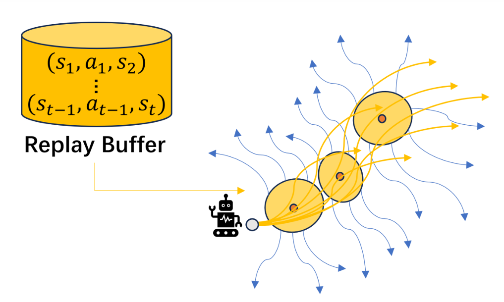
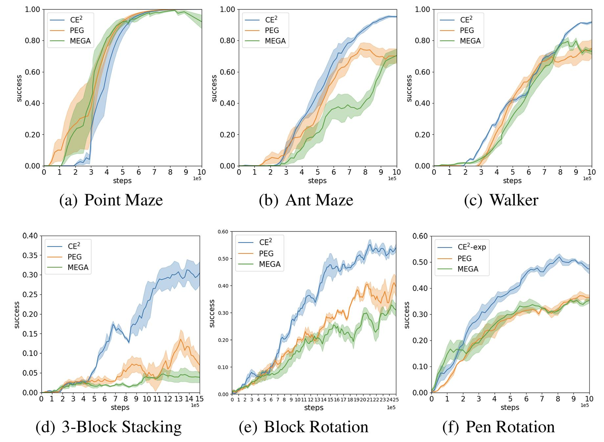

# Exploring the Edges of Latent State Clusters for Goal-Conditioned Reinforcement Learning (CE2)
Yuanlin Duan, Guofeng Cui and He Zhu

Code for "Exploring the Edges of Latent State Clusters for Goal-Conditioned Reinforcement Learning" (NeurIPS 2024), a method to do efficent exploration for GCRL.

If you find our paper or code useful, please reference us:
```
@article{duan2024exploring,
  title={Exploring the Edges of Latent State Clusters for Goal-Conditioned Reinforcement Learning},
  author={Duan, Yuanlin and Cui, Guofeng and Zhu, He},
  journal={arXiv preprint arXiv:2411.01396},
  year={2024}
}
```

CE2 learns the latent space by temporary distance estimator, reflecting the reachability of states in latent space. Then CE2 dose clustering to group states that are easily reachable from one another by the current policy under the latent space and traversing to states holding significant exploration potential on the boundary of these clusters before doing exploratory behavior. CE^2 selects goal states at the edges of these latent state clusters for exploration because 
(1) less explored regions are naturally adjacent to these boundaries.
(2) given the easy accessibility between states within each cluster by the 	training policy, the agent’s capability extends to reaching states even at the cluster boundaries.




CE2 outperforms other exploration approaches across a variety of tasks.


<!--   -->

## Code Structure

```
CE2/
  |- Config/                    # config file for each environment.
  |- dreamerv2/                 # C^2 implement
  |- dreamerv2/gc_main.py       # Main running file
```

### Step 1: CE2 installation

pip intall all dependencies:

```bash
pip install -r library.txt
```

And then, run:

```bash
pip install -e .
```

### Step 2: Environment installation
We evaluate CE2 on six environments: Ant Maze, Point Maze, Walker, 3-block Stacking, Block Rotation, Pen Rotation.

MUJOCO install: [MuJoCo 2.0](https://www.roboti.us/download.html)

Ant Maze, Point Maze, 3-Block Stack environments:

The `mrl` codebase contains Ant Maze, Point Maze, and 3-block Stack environments.
```bash
git clone https://github.com/hueds/mrl.git
```

Before testing these three environments, you should make sure that the `mrl` path is set in the `PYTHONPATH`.

```bash
export PYTHONPATH=<path to your mrl folder>
```

Walker environment:

Clone the `lexa-benchmark` and `dm_control` repos.

```bash
git clone https://github.com/hueds/dm_control
git clone https://github.com/hueds/lexa-benchmark.git
```

Set up `dm_control` as a local python module:
```bash
cd dm_control
pip install .
```

Set `LD_PRELOAD` to the libGLEW path, and set the `MUJOCO_GL` and `MUJOCO_RENDERER` variables.

```bash
# if you want to run environments in the lexa-benchmark codebase
MUJOCO_GL=egl MUJOCO_RENDERER=egl LD_PRELOAD=/usr/lib/x86_64-linux-gnu/libGLEW.so:/usr/lib/x86_64-linux-gnu/libGL.so  PYTHONPATH=<path to your lexa-benchmark folder like "/home/edward/lexa-benchmark">
```


### Step 3: Run CE2

Training Scripts:

```bash
python dreamerv2_APS/gc_main.py --configs RotatePen(environment name in config file) --logdir "your logdir path"
```

Use the tensorboard to check the results.

```bash
tensorboard --logdir ~/logdir/your_logdir_name
```

## Acknowledgements
CE2 builds on many prior works, and we thank the authors for their contributions.

- [PEG](https://github.com/penn-pal-lab/peg) for the goal-cond MBRL Agent and goal picking for exploration implement
- [Dreamerv2](https://github.com/danijar/dreamerv2) for the non-goal-cond. MBRL agent
- [LEXA](https://github.com/orybkin/lexa) for goal-cond. policy training logic, P2E exploration, and Walker task
- [mrl](https://github.com/spitis/mrl) for their implement of baselines and environments
